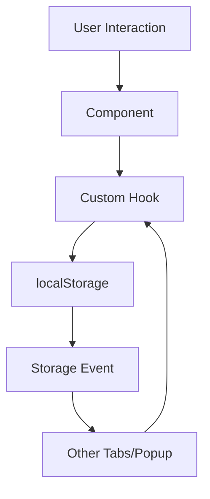

## Project Overview

Better Home is a Chrome extension built with modern web technologies, designed to replace the default new tab page with a minimal, customizable experience featuring tasks, quick links, and a mood calendar.

## Tech Stack

<CardGroup cols={2}>
  <Card title="React 19" icon="react">
    UI framework with latest concurrent features
  </Card>
  <Card title="TypeScript 5.9" icon="code">
    Type-safe development with strict mode enabled
  </Card>
  <Card title="Vite 7" icon="bolt">
    Lightning-fast bundler with HMR support
  </Card>
  <Card title="Tailwind CSS 4" icon="palette">
    Utility-first styling with custom design system
  </Card>
  <Card title="shadcn/ui" icon="box">
    Accessible, composable UI components
  </Card>
  <Card title="Motion" icon="wand-magic-sparkles">
    Smooth animations (v12)
  </Card>
  <Card title="Tabler Icons" icon="icons">
    Crisp, consistent iconography
  </Card>
  <Card title="Bun" icon="rocket">
    Ultra-fast package manager and runtime
  </Card>
</CardGroup>

## Project Structure

```
better-home/
├── src/
│   ├── components/          # React components
│   │   ├── ui/             # shadcn/ui base components
│   │   ├── calendar-placeholder.tsx
│   │   ├── date-popover.tsx
│   │   ├── interactive-calendar.tsx
│   │   ├── mode-toggle.tsx
│   │   ├── month-grid.tsx
│   │   ├── mood-selector.tsx
│   │   ├── quick-links.tsx
│   │   ├── theme-provider.tsx
│   │   └── todo-list.tsx
│   ├── hooks/              # Custom React hooks
│   │   ├── use-calendar-data.ts
│   │   └── use-local-storage.ts
│   ├── lib/                # Utility functions
│   │   ├── backup-utils.ts
│   │   ├── calendar-constants.ts
│   │   ├── calendar-utils.ts
│   │   ├── todo-utils.ts
│   │   └── url-utils.ts
│   ├── types/              # TypeScript type definitions
│   │   ├── calendar.ts
│   │   ├── todo.ts
│   │   └── widget-settings.ts
│   ├── app.tsx             # Main application component
│   ├── main.tsx            # Application entry point
│   └── popup.tsx           # Extension popup UI
├── public/                 # Static assets
│   ├── manifest.json       # Chrome extension manifest
│   └── *.png              # Extension icons
├── dist/                   # Production build output
├── index.html              # Main page (new tab)
├── popup.html              # Extension popup page
├── vite.config.ts          # Vite configuration
├── tsconfig.json           # TypeScript configuration
├── biome.jsonc             # Biome linter configuration
└── package.json            # Project dependencies
```

## Core Architecture

### Application Entry

The extension has two entry points:

1. **`index.html`** → `src/main.tsx` → `src/app.tsx` - The main new tab page
2. **`popup.html`** → `src/popup.tsx` - The extension popup (settings)

Both are configured as multi-page inputs in `vite.config.ts`:

```typescript vite.config.ts
build: {
  rollupOptions: {
    input: {
      main: path.resolve(__dirname, "index.html"),
      popup: path.resolve(__dirname, "popup.html"),
    },
  },
}
```

### Component Organization

Components are organized into three categories:

<Tabs>
  <Tab title="Feature Components">
    Located in `src/components/`, these implement the core widgets:
    
    - **`todo-list.tsx`** - Task management widget
    - **`quick-links.tsx`** - Bookmarks with favicons
    - **`interactive-calendar.tsx`** - Mood calendar with year/quadrimester views
    - **`month-grid.tsx`** - Calendar month rendering
    - **`mood-selector.tsx`** - Mood selection UI
    - **`date-popover.tsx`** - Date detail popover with notes
    - **`theme-provider.tsx`** - Dark/light theme management
    - **`mode-toggle.tsx`** - Theme switcher component
  </Tab>
  
  <Tab title="UI Components">
    Located in `src/components/ui/`, these are shadcn/ui primitives:
    
    - `button.tsx`, `card.tsx`, `checkbox.tsx`
    - `input.tsx`, `label.tsx`, `textarea.tsx`
    - `popover.tsx`, `tooltip.tsx`, `dropdown-menu.tsx`
    - `context-menu.tsx`, `separator.tsx`, `switch.tsx`
    - `scroll-area.tsx`
    
    All built on Radix UI primitives for accessibility.
  </Tab>
  
  <Tab title="Layout Components">
    The main `app.tsx` component handles responsive layout logic:
    
    - Reads widget visibility settings from localStorage
    - Dynamically renders layouts based on enabled widgets
    - Supports 8 layout combinations (none, tasks, links, calendar, and all combinations)
    - Adapts to screen size with responsive breakpoints
  </Tab>
</Tabs>

### State Management

Better Home uses **localStorage** for all state persistence, avoiding external state management libraries.

<CodeGroup>
```typescript Custom Hook
// src/hooks/use-local-storage.ts
export function useLocalStorage<T>(
  key: string,
  initialValue: T
): [T, (value: T | ((prev: T) => T)) => void] {
  // Syncs state with localStorage
  // Handles storage events for cross-tab sync
  // Returns [value, setValue] tuple like useState
}
```

```typescript Usage Example
// src/app.tsx
const [settings] = useLocalStorage<WidgetSettings>(
  "better-home-widget-settings",
  DEFAULT_WIDGET_SETTINGS
);
```
</CodeGroup>

**Storage Keys:**
- `better-home-widget-settings` - Widget visibility preferences
- `better-home-todos` - Task list data
- `better-home-links` - Quick links data
- `better-home-calendar-2026` - Mood calendar entries
- `vite-ui-theme` - Theme preference (light/dark/system)

### Type System

All data structures are strictly typed:

```typescript src/types/widget-settings.ts
export interface WidgetSettings {
  showTasks: boolean;
  showQuickLinks: boolean;
  showCalendar: boolean;
}
```

```typescript src/types/todo.ts
export interface TodoItem {
  id: string;
  text: string;
  completed: boolean;
  createdAt: number;
}
```

```typescript src/types/calendar.ts
export interface CalendarEntry {
  date: string; // YYYY-MM-DD format
  mood: MoodLevel;
  note?: string;
}

export type MoodLevel = 1 | 2 | 3 | 4 | 5;
```

### Path Aliases

The project uses `@/` as a path alias for the `src/` directory:

```typescript
import { TodoList } from "@/components/todo-list";
import { useLocalStorage } from "@/hooks/use-local-storage";
import { cn } from "@/lib/utils";
```

Configured in both `tsconfig.json` and `vite.config.ts` for consistency.

## Build Process

### Development Build

Running `bun run dev` starts the Vite dev server:

1. Loads React with Fast Refresh via `@vitejs/plugin-react-swc`
2. Processes Tailwind CSS via `@tailwindcss/vite`
3. Resolves `@/` path aliases
4. Serves on `http://localhost:5173`

### Production Build

Running `bun run build` creates an optimized production bundle:

1. **Type checking:** `tsc -b` validates all TypeScript
2. **Bundling:** Vite bundles JavaScript, CSS, and assets
3. **Code splitting:** Separates main and popup entry points
4. **Minification:** Minifies JavaScript and CSS
5. **Asset optimization:** Optimizes images and fonts
6. **Output:** Generates `dist/` folder ready for browser loading

### Extension Manifest

The `public/manifest.json` defines the extension structure:

```json
{
  "manifest_version": 3,
  "name": "better-home",
  "version": "1.3.0",
  "chrome_url_overrides": {
    "newtab": "index.html"
  },
  "action": {
    "default_popup": "popup.html"
  },
  "permissions": []
}
```

No special permissions required - all data stays in localStorage.

## Styling System

### Tailwind CSS

Better Home uses Tailwind CSS 4 with a custom design system:

- **CSS variables** for theme colors (light/dark mode)
- **Utility classes** for all styling
- **Custom animations** via `tw-animate-css`
- **Motion animations** for smooth transitions

### Theme System

Themes are managed via the `ThemeProvider` component:

- Supports light, dark, and system preferences
- Persists choice in localStorage
- Syncs across popup and main page via Chrome messaging
- Uses CSS class toggling (`light`/`dark` on `<html>`)

## Animation Strategy

Animations use the **Motion** library (formerly Framer Motion):

```typescript
import { motion, AnimatePresence } from "motion/react";

// Smooth enter/exit animations
<AnimatePresence mode="popLayout">
  <motion.div
    initial={{ opacity: 0, y: -10 }}
    animate={{ opacity: 1, y: 0 }}
    exit={{ opacity: 0, y: 10 }}
  >
    {content}
  </motion.div>
</AnimatePresence>
```

Key animation features:
- List item reordering with layout animations
- Smooth fade-in/out for modals and popovers
- Calendar mood transitions
- Today highlight pulse effect

## Data Flow



1. User interacts with a component (e.g., adds a task)
2. Component calls hook's setter (e.g., `setTodos`)
3. Hook updates localStorage and local state
4. Storage event fires for cross-tab synchronization
5. Other tabs/popup receive update and re-render

This architecture ensures data consistency across all extension instances without a backend.
